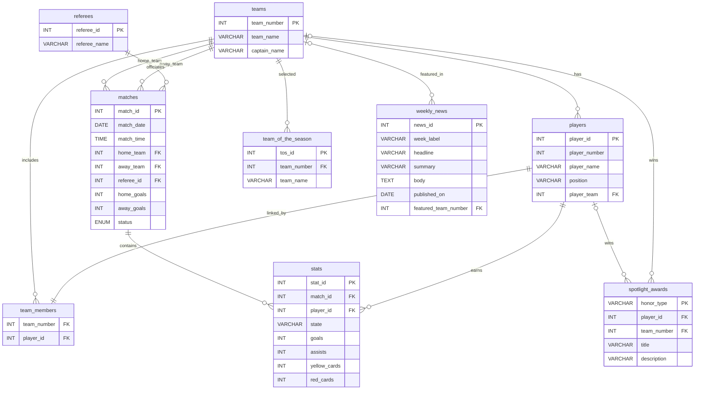
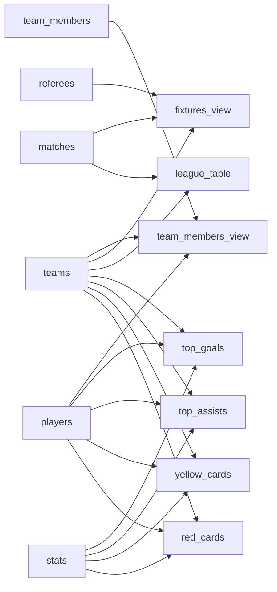
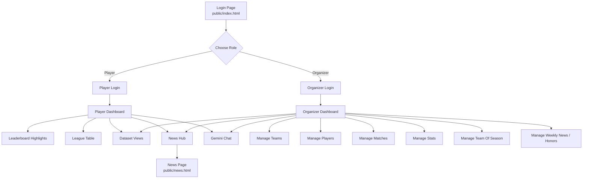
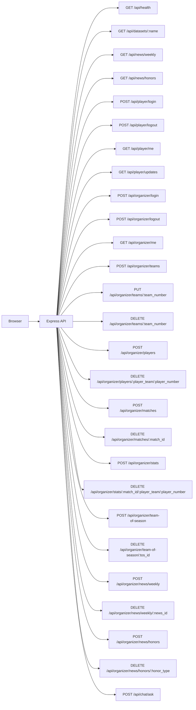
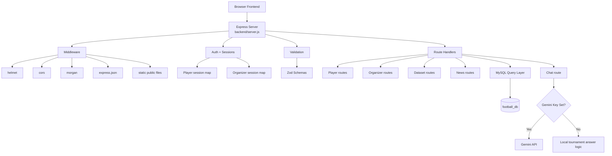
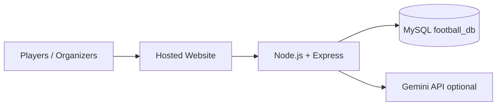

# ISU Football Tournament Diagrams

This file documents the current database, frontend, backend, API, and deployment structure of the ISU Football Tournament system.

## 1. Database ERD

## 2. Database Views

## 3. Frontend Flow

## 4. API Diagram

## 5. Backend Architecture

## 6. Deployment Diagram

## 7. Scenario Text For Designing Diagrams

### Scenario 1: Player Access Scenario

Text:
The player opens the ISU Football Tournament website and sees the login page. The player selects the player role and logs in using the username format `player name + player number` and the code format `player number`. After login, the system validates the player account through the backend and MySQL database. If the login is correct, the player enters the player dashboard. From there, the player can view the leaderboard highlights, league table, teams, players, fixtures, weekly news, and personal tournament updates. The player can also use the chat assistant to ask questions about teams, captains, standings, and tournament information.

Simple flow:
1. Player opens website.
2. Player selects player role.
3. Player enters username and code.
4. Frontend sends login request to backend.
5. Backend checks player in database.
6. Backend creates session and returns success.
7. Player enters dashboard.
8. Player views updates, tables, and news.

### Scenario 2: Organizer Management Scenario

Text:
The organizer opens the ISU Football Tournament website and selects the organizer role. The organizer logs in with the organizer username and password. The frontend sends the login request to the backend, and the backend checks the organizer credentials. After successful login, the organizer enters the organizer dashboard. The organizer can add new teams, update old teams, add players, update player positions, create matches, save player stats, publish weekly news, and manage awards like best player of the week or best team of the month. Every action from the organizer panel is sent through the API to the backend, and the backend saves the changes directly into MySQL. After saving, the updated data becomes visible on the website.

Simple flow:
1. Organizer opens website.
2. Organizer selects organizer role.
3. Organizer logs in.
4. Frontend sends request to backend.
5. Backend checks organizer account.
6. Organizer opens control panel.
7. Organizer creates or updates data.
8. API sends changes to database.
9. Website reloads updated data from database.

### Scenario 3: Match And Statistics Update Scenario

Text:
The organizer creates or updates a match from the organizer control panel. The organizer enters the match ID, date, time, home team, away team, and match status. After the match is created, the organizer can open the player stats section and insert stat lines for a player, including goals, assists, yellow cards, and red cards. The frontend sends these stat values to the backend API. The backend validates the request, finds the correct player in the database, and inserts the statistics into the stats table. Once saved, the leaderboard views such as top goals, top assists, yellow cards, and red cards update automatically from the database views.

Simple flow:
1. Organizer creates or updates match.
2. Match is stored in MySQL.
3. Organizer enters player stat line.
4. Backend saves stat line in `stats`.
5. Database views update.
6. Frontend reloads top goals, assists, and cards.

### Scenario 4: Weekly News Publishing Scenario

Text:
The organizer opens the News Hub page and enters a weekly news post. The organizer fills in the week label, headline, summary, body, published date, and optionally a featured team number. The frontend sends this information to the backend news API. The backend validates the content and stores it in the `weekly_news` table. After saving, the Weekly News section becomes visible to all users on the News Hub page. Players, organizers, and visitors can read the published news directly from the database through the API.

Simple flow:
1. Organizer opens News Hub.
2. Organizer writes weekly news.
3. Frontend sends request to backend.
4. Backend stores data in `weekly_news`.
5. Public users read the published news.

### Scenario 5: Spotlight Awards Scenario

Text:
The organizer publishes awards such as best player of the week, best team of the week, or best team of the month. The organizer enters the required player number or team number and submits the form. The backend validates the request and saves the award into the `spotlight_awards` table. The News Hub and tournament interface then display the current spotlight awards to users. This allows the system to present tournament recognition and highlights in a structured way.

Simple flow:
1. Organizer selects award type.
2. Organizer enters player or team information.
3. Frontend sends award request.
4. Backend saves award in `spotlight_awards`.
5. Frontend displays award in news and highlights sections.

### Scenario 6: Chat Assistant Scenario

Text:
The logged-in user opens the chat assistant from the website. The user asks a question about the tournament, such as team information, player information, standings, fixtures, or weekly news. The frontend sends the question to the backend chat route. If a Gemini API key is configured, the backend sends the question and tournament context to Gemini. If Gemini is not configured, the backend falls back to the local tournament answer engine. The backend returns the answer to the frontend, and the user sees the response inside the chat panel.

Simple flow:
1. User opens chat.
2. User sends question.
3. Frontend sends message to `/api/chat/ask`.
4. Backend prepares tournament data context.
5. Backend sends to Gemini or local engine.
6. Backend returns answer.
7. User sees response in chat.

## 8. Short Design Notes

- The main actors are `Player` and `Organizer`.
- The main system layers are `Frontend`, `Backend/API`, and `MySQL Database`.
- The main business entities are `teams`, `players`, `matches`, `stats`, `weekly_news`, and `spotlight_awards`.
- The main public views are `league_table`, `top_goals`, `top_assists`, `yellow_cards`, `red_cards`, and `team_members_view`.
- The project supports an optional AI chat layer through Gemini.
